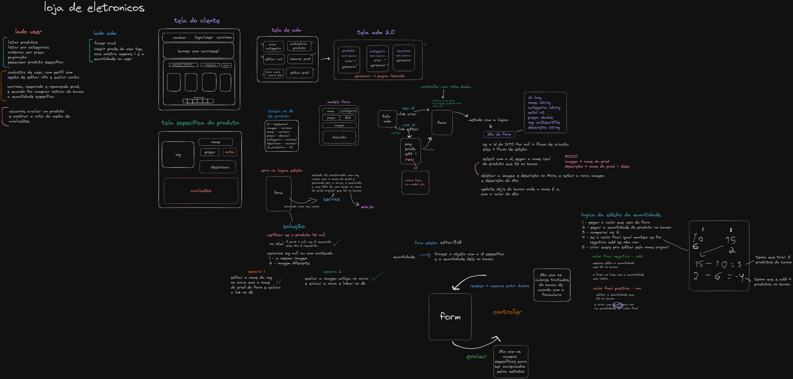

## **Sobre o projeto**

Surgiu da ideia de treinar e colocar em prática o conhecimento aprendido em Java e Spring Boot que venho estudando em média 1 ano, o projeto é uma loja de produtos eletrônicos, onde o gerente pode fazer a gestão de produtos e o cliente podendo comprar, avaliar e gerenciar suas contas e seu carrinho de produtos.

> *Obs. O projeto continua em andamento, apenas a função principal de CRUD está concluída, o restante será implementado com o tempo.*

## **Fluxo de pensamento até agora**



> *Organizei antes oque precisaria usar no projeto e a lógica necessária, aqui está presente aquilo que senti necessidade de parar para pensar, oque não está aqui eu fiz arquitetando e com a mão na massa mesmo, esse fluxo representa apenas a lógica de gerenciamento do produto, com mais funções implementadas irá aumentar bastante de tamanho.*

## **Tecnologias Usadas**


### Implementado
- Arquitetura MVC com Thymeleaf, MySQL
- Uso do Min.io Object Store para guardar imagens e descrição
- Crud de produtos e Categorias
- Validações de Formulários
- Uso do rich text Quill no formulário 
- Filtro dinâmico para pesquisar produtos
- Paginação dos dados
- Tratamento de erros com páginas personalizadas
- Conteinerização da Aplicação, Database e do Min.io Object Store

### Futuramente Implementado
- Testes de Integração
- Versão do Cliente com Crud
- Carrinho de Compras
- Avaliação de Produtos

## **Imagens do Funcionamento**

 #### Layout da Home e Gerente
 


---

#### Criando Produto e Mostrando Descrição


---

#### Visão da Home e Filtro Dinâmico


---

#### Gerenciamento de Produtos, Editar e Excluir


## **Rodando a Aplicação**

```shell
# comando padrão para subir os serviços: 
docker compose up -d

# se o banco não iniciar antes devido ao tempo de inicialização 
# do container, comprometendo o funcionamento do spring boot, primero digite: 
docker compose up -d mysql minio

# em seguida quando o container mysql estiver pronto:
docker compose up -d megabyte

# quando subir todos os serviços com sucesso, você deverá acessar o endpoint
"http://localhost:9001/login"

# com as seguintes credenciais
username: "minioadmin"
password: "megabyte-adm-999"

# depois criar um bucket no min.io com o nome de "repository" e selecionar como public
```